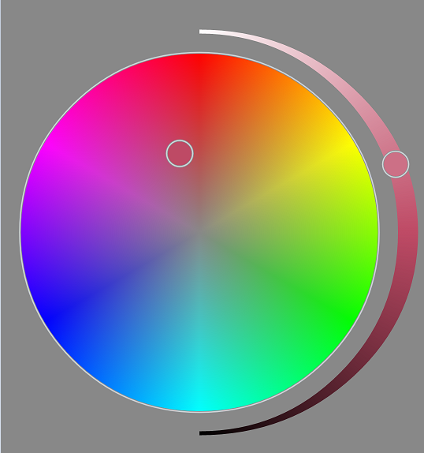

# AndroidCircleColorPicker
Android上的圆形取色器控件
A widget for pick color.

##效果图 DEMO


##使用方式 Usage
像普通View一样使用;
Use it like a normal View;

```xml
    <com.cyanflxy.widget.CircleColorPicker
        android:id="@+id/color_picker"
        android:layout_width="wrap_content"
        android:layout_height="wrap_content"
        android:background="#888888"/>

```

监听颜色变化；
Listen color picked；

```java
    mCircleColorPicker.setOnColorSelectedListener(new CircleColorPicker.OnColorSelectedListener() {
        @Override
        public void onColorSelected(int color) {
            // Your Code With Color
        }
    });
```

获取当前选择的颜色;
Get Current Color;

```java
    int color = mCircleColorPicker.getColor();
```

状态获取和设置；
Get and Set State;

```java
    String stateString = mCircleColorPicker.getState();
    mCircleColorPicker.setState(stateString);
```


## License

```java
/*
 * Copyright (C) 2015 CyanFlxy <cyanflxy@163.com>
 *
 * Licensed under the Apache License, Version 2.0 (the "License");
 * you may not use this file except in compliance with the License.
 * You may obtain a copy of the License at
 *
 *      http://www.apache.org/licenses/LICENSE-2.0
 *
 * Unless required by applicable law or agreed to in writing, software
 * distributed under the License is distributed on an "AS IS" BASIS,
 * WITHOUT WARRANTIES OR CONDITIONS OF ANY KIND, either express or implied.
 * See the License for the specific language governing permissions and
 * limitations under the License.
 */
```

## About Author
Blog:[http://blog.csdn.net/cyanflxy](http://blog.csdn.net/cyanflxy)

E-mail:[cyanflxy@163.com](mailto:cyanflxy@163.com)

