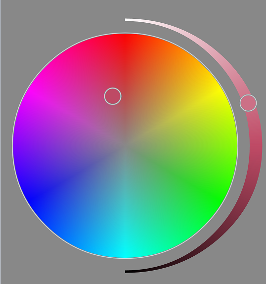
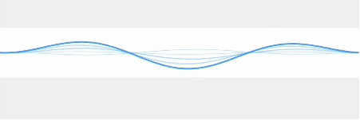

# CyanFlxy Android Widget
CyanFlxy 自定义 Android 控件集
使用方法和普通View保持一致，详情见代码。

Usage：RTFSC.

##效果图 DEMO


###ColorPickerView
圆形取色器控件



###SineWave
像Siri那样的正弦波纹效果




## License

```java
/*
 * Copyright (C) 2015 CyanFlxy <cyanflxy@163.com>
 *
 * Licensed under the Apache License, Version 2.0 (the "License");
 * you may not use this file except in compliance with the License.
 * You may obtain a copy of the License at
 *
 *      http://www.apache.org/licenses/LICENSE-2.0
 *
 * Unless required by applicable law or agreed to in writing, software
 * distributed under the License is distributed on an "AS IS" BASIS,
 * WITHOUT WARRANTIES OR CONDITIONS OF ANY KIND, either express or implied.
 * See the License for the specific language governing permissions and
 * limitations under the License.
 */
```

## About Author
Blog:[http://blog.csdn.net/cyanflxy](http://blog.csdn.net/cyanflxy)

E-mail:[cyanflxy@163.com](mailto:cyanflxy@163.com)

